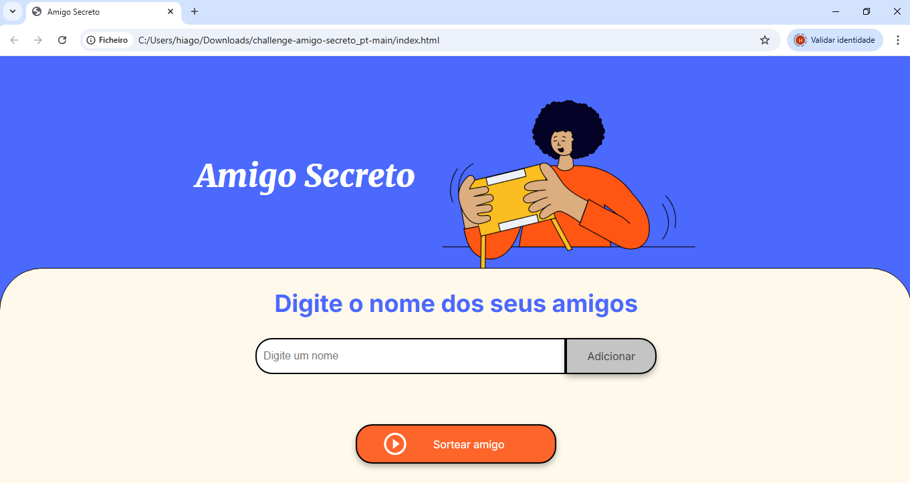

# 🎁 Amigo Secreto

Este é um projeto simples de **Amigo Secreto**, onde os usuários podem adicionar nomes a uma lista e sortear aleatoriamente os pares de amigos secretos.

## 🚀 Funcionalidades

- Adicionar nomes à lista de participantes.
- Validar entradas para evitar nomes vazios ou duplicados.
- Exibir a lista de amigos adicionados.
- Realizar o sorteio de forma justa, garantindo que ninguém tire a si mesmo.
- Exibir os pares sorteados na tela.

## 🛠️ Tecnologias Utilizadas

- **HTML5** → Estrutura do projeto.
- **CSS3** → Estilização da interface.
- **JavaScript (ES6+)** → Manipulação da DOM e lógica do sorteio.

## 📋 Como Usar

1. **Clone o repositório**:
   git clone https://github.com/HiagoAlvesdasilva/Challenge-Amigo-secreto-.git

2. **Acesse a pasta doProjeto**:
- cd Challenge-Amigo-secreto-

3.**Abra o arquivo**:
- index.html

📷 Captura de Tela

